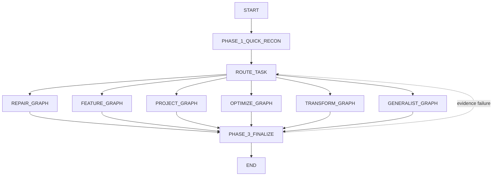

# Long-Running Coding Agent 状态机设计

本文定义 LightCoder 的权威控制模型。它面向持续数小时、跨多个模型上下文、可在进程重启后恢复的编码任务。节点 skills 负责节点内的专业判断，状态迁移、持久化、预算、恢复和终止由确定性代码负责。

状态字段和磁盘协议见 [`coding-agent-state-schema.md`](coding-agent-state-schema.md)。节点级细节见 [`skills/`](../skills/)。

## 1. 设计原则

1. **代码拥有控制权**：模型只能返回候选 `NodeResult`，不能直接修改当前节点、预算或完成状态。
2. **状态先于对话**：工作连续性来自磁盘状态、仓库和证据，而不是依赖完整聊天历史。
3. **一次只推进一个可验收增量**：每次循环选择一个 action、subgoal、acceptance item、milestone、hypothesis 或 transformation step。
4. **生成与验证分离**：实现节点不能为自己的结果签发最终通过；验证节点使用新的模型调用或确定性命令，并只读取产物和显式状态。
5. **完成必须有外部证据**：叙述性自信、代码量和迭代次数均不是完成依据。
6. **每次迁移可恢复**：节点开始、工具副作用、节点结束和路由决定均有持久记录；重复调度不得重复不可逆副作用。
7. **外部限制不可由模型修改**：时间、token、费用、循环次数、命令超时和并发限制来自 CLI/config。
8. **Skill 与 Memory 分离**：Skill 是受版本控制的可复用流程；Memory 是当前运行产生、带来源和置信度的事实、决策及交接。

## 2. 两层状态机

LightCoder 使用“运行时包络 + 任务子图”，而不是把所有可靠性逻辑塞进业务节点。

### 2.1 运行时包络

每个业务节点都由同一个确定性包络调度：

```text
LOAD_OR_CREATE_RUN
  -> ACQUIRE_RUN_LEASE
  -> RECOVER_INCOMPLETE_ATTEMPT
  -> CHECK_EXTERNAL_LIMITS
  -> PREPARE_CONTEXT
  -> DISPATCH_ACTIVE_NODE
  -> EXECUTE_NODE
  -> VALIDATE_NODE_RESULT
  -> COMMIT_NODE_RESULT
  -> CHECK_CONTEXT_BOUNDARY
  -> RESOLVE_ROUTE
  -> CHECKPOINT
  -> next business node
```

异常和暂停分支：

```text
EXECUTE_NODE --tool/model transient error--> RETRY_ATTEMPT
EXECUTE_NODE --deterministic failure------> COMMIT_FAILED_ATTEMPT -> RESOLVE_ROUTE
CHECK_EXTERNAL_LIMITS --limit reached------> PAUSED_LIMIT
PREPARE_CONTEXT --missing user fact--------> WAITING_INPUT
EXECUTE_NODE --external process pending----> WAITING_EXTERNAL
any state --SIGINT/process exit------------> CHECKPOINTING -> PAUSED
final verification exhausted--------------> FAILED
```

这些包络状态不是 Agent Skills。后续运行时必须用普通 Python 实现，不能依赖现成智能体框架。

### 2.2 业务状态机



三阶段含义：

| 阶段 | 目标 | 退出条件 |
| --- | --- | --- |
| Phase 1 | 用最小侦察建立 `TaskProfile` 和可验证的任务分类 | 工作区、交付物、主要 oracle、风险和任务类型均有证据 |
| Phase 2 | 在专用闭环中反复执行一个小增量并验证 | 专用完成检查通过，生成 candidate-complete checkpoint |
| Phase 3 | 在干净条件下独立复验、检查 diff/产物和完整性 | 所有 mandatory oracle 通过，交付报告与证据一致 |

`PHASE_2_TASK_LOOP` 是图示和统计使用的 virtual 聚合节点，不进入实际调度队列。实际路由是 `ROUTE_TASK -> <FLOW>_GRAPH -> INITIALIZE_<FLOW>_STATE`。

## 3. 节点类型与执行模式

manifest 中每个节点必须声明 `kind` 和 `execution_mode`。

### 3.1 `control`

- 只读结构化状态并选择合法路由。
- 优先使用确定性实现；仅在分类或归因确实需要语义判断时调用模型。
- 不执行 shell、不修改仓库、不生成新的任务预算。
- 代表节点：`START`、所有 `*_LOOP_START`、`PHASE_2_TASK_LOOP`、`END`。

### 3.2 `decision`

- 选择一个下一工作单元、形成假设或判断是否应重新路由。
- 模型输出必须符合 JSON schema，并附引用的 evidence id。
- 不能宣告最终成功，除非对应 completion 节点的硬性 oracle 已由验证记录满足。
- 代表节点：`ROUTE_TASK`、`SELECT_NEXT_*`、`CHECK_*_COMPLETION`。
- `INITIALIZE_*_STATE` 也属于模型辅助决策：模型提出初始分解，controller 校验后才写入状态。

### 3.3 `action`

- 允许读取、编辑和运行命令，但一次只执行当前 work item。
- 执行前记录 base revision；执行后记录 diff、modified files、命令和副作用。
- 不允许把测试禁用、扩大 scope 或修改外部预算来制造成功。
- 代表节点：`IMPLEMENT_*`、`APPLY_*`、`FIX_*`、`EXECUTE_SUBGOAL`。
- rollback 使用 `deterministic_tool` 执行模式；它可以操作仓库，但不能调用模型扩展任务。

### 3.4 `verification`

- 使用与生成节点隔离的新上下文；默认不读取生成节点的自由文本推理。
- 先运行最窄 oracle，再按风险扩大回归范围。
- 输出结构化 `VerificationRecord`，保留命令、退出码、摘要和原始日志引用。
- 代表节点：`VERIFY_*`、`RUN_*_VALIDATION`、`RUN_INTEGRITY_CHECK`。

### 3.5 `state`

- 合并经过验证的事实、维护 attempt history、checkpoint 和索引。
- 由确定性代码执行；skill 只描述字段语义，不应调用模型。
- 代表节点：`UPDATE_*_STATE` 和各 `*_COMPLETE`；`CHECKPOINT_PROJECT_STATE`、`ACCEPT_*` 使用受限的 `deterministic_tool` 模式。

### 3.6 `delivery`

- 生成由 evidence 支持的简洁报告或提交已验证产物。
- 不能在 final validation 或 integrity check 未通过时提交成功状态。

## 4. Phase 1：侦察与路由

### 4.1 `START`

创建或加载 run，冻结 `external_run_config`，生成 run id。它不读取代码。

### 4.2 `PHASE_1_QUICK_RECON`

侦察必须控制在一个紧凑上下文内，只读取任务、仓库入口、构建文件、局部相关代码和已有测试。输出：

- `task_profile.kind_candidates` 及置信度；
- mandatory/optional deliverables；
- 可运行的 acceptance oracles；
- scope、non-goals、风险、未知项；
- 仓库根、语言、构建系统、测试入口和基线 revision。

禁止在这里做广泛索引或开始实现。

### 4.3 `ROUTE_TASK`

路由优先级不是固定类别优先级，而是 oracle 匹配：

| Flow | 进入证据 |
| --- | --- |
| repair | 存在具体错误行为，目标是恢复既有契约 |
| feature | 在现有项目上增加明确验收行为，规模可用多个垂直增量完成 |
| project | 需要建立多个模块/里程碑和可运行集成系统 |
| optimize | 正确性约束稳定，目标由可重复度量的指标定义 |
| transform | 目标是重构、迁移或兼容性变化，需保持显式不变量 |
| generalist | 混合型、文档/配置类、信息不足或尚不能形成专用 oracle |

重新路由必须引用首次路由之后出现的新 evidence；相同两条 flow 间连续往返两次触发 `routing_stall`，转入 generalist 重新分解或暂停。

## 5. Phase 2：专用闭环

所有子图遵守共同循环：

```text
initialize -> select one work item -> act -> verify -> update state
           -> completion check -> loop / reroute / candidate complete
```

### 5.1 Repair

```text
INITIALIZE_REPAIR_STATE -> REPAIR_LOOP_START -> SELECT_NEXT_REPAIR_ACTION
  -> REPRODUCE_OR_INSPECT | LOCALIZE_RELEVANT_CODE
  |  FORM_ROOT_CAUSE_HYPOTHESIS | IMPLEMENT_MINIMAL_PATCH
IMPLEMENT_MINIMAL_PATCH -> VERIFY_REPAIR
VERIFY_REPAIR
  -> UPDATE_REPAIR_STATE          (目标和回归通过)
  -> UPDATE_FAILURE_SIGNATURE     (错误特征发生可解释变化)
  -> REPLAN_REPAIR                (无进展、回归或假设被否证)
UPDATE_REPAIR_STATE -> CHECK_REPAIR_COMPLETION
CHECK_REPAIR_COMPLETION -> REPAIR_COMPLETE | REPAIR_LOOP_START | ROUTE_TASK
```

修复完成需要原始复现通过、相关回归通过、未出现未解释新失败，并有 regression test 或无法添加测试的明确证据。

### 5.2 Feature

每个 acceptance item 必须包含 observable behavior、oracle、依赖项和兼容义务。实现使用可端到端演示的垂直增量，不能按“先写完所有后端再验证”推进。

验证失败按三类处理：契约不清转 `REVISE_FEATURE_CONTRACT`；局部实现/集成缺口转 `DIAGNOSE_FEATURE_GAP`；证据显示规模或类型改变则在 completion check 转 `ROUTE_TASK`。

### 5.3 Project

项目图用 requirements matrix、milestone DAG、module contracts 和 architecture decisions 管理长程状态。每个 milestone 必须产生可运行垂直切片，并在接受后创建稳定 checkpoint。

最终进入 `RUN_END_TO_END_ACCEPTANCE` 前，所有 mandatory requirement rows 必须有 evidence。端到端失败通过 `MAP_FAILURE_TO_MILESTONE` 回填到最早负责的里程碑，而不是继续在 finalization 中临时修补。

### 5.4 Optimize

先冻结正确性 oracle、数据/环境、主指标、重复次数、噪声容忍度和比较规则。每轮只测试一个可证伪 hypothesis。

候选只有在正确性通过且达到预设改进规则时才能接受。停止原因与成功状态分开：达到外部限制可以停止实验，但不等于达到性能目标。

### 5.5 Transform

重构先捕获行为基线，迁移先捕获构建兼容基线。每个 transformation step 只改变一个结构/API/依赖边界，并在接受前同时检查 build、behavior 和 compatibility。

失败候选必须先回滚到 accepted revision，再诊断，避免多个未验证迁移叠加。

### 5.6 Generalist

Generalist 维护 outcome list 和有局部 oracle 的 subgoal DAG。每次只选择一个 ready subgoal，再选择已有 skill 或基础工具执行。

一旦 evidence 足以形成专用 flow，`VERIFY_SUBGOAL` 可转回 `ROUTE_TASK`。连续多个 subgoal 没有新增 evidence 或相同 failure signature 重复出现时进入停滞处理；停滞处理必须改变分解、假设、工具或验证方式，而不是终止整个 run。

## 6. Phase 3：候选完成与最终完成

Phase 2 只能生成 `candidate_complete`，不能直接把 run 标成 completed。

最终流程：

```text
RUN_CLEAN_ENVIRONMENT_VALIDATION
  pass -> INSPECT_FINAL_DIFF_AND_ARTIFACTS
  fail -> ROUTE_FAILURE_BACK
INSPECT_FINAL_DIFF_AND_ARTIFACTS -> RUN_INTEGRITY_CHECK
RUN_INTEGRITY_CHECK
  pass -> GENERATE_CONCISE_REPORT
  removable issue -> REMOVE_INVALID_CHANGES -> RUN_CLEAN_ENVIRONMENT_VALIDATION
  blocking issue -> ROUTE_FAILURE_BACK or FAILED
GENERATE_CONCISE_REPORT -> SUBMIT_PATCH_OR_PROJECT -> END
```

最终完成的必要条件：

- mandatory deliverables 均存在且位于允许路径；
- clean validation 的必选命令退出码为 0；
- acceptance matrix 每个 mandatory row 都引用 passing evidence；
- diff 与任务 scope 一致，无禁用测试、硬编码答案、秘密或无关产物；
- 报告中的每项完成声明可追溯到 evidence id；
- 交付 revision 与已验证 revision 相同。

## 7. 上下文边界与会话切换

上下文管理由运行时包络触发，不由业务节点自行决定。

触发条件满足任一项：

- 估算输入 token 达到模型窗口的 70%；
- 活跃会话完成一个节点且累计工具输出超过阈值；
- 模型返回 context-limit 错误；
- 当前循环出现信息重复或计划漂移；
- 外部配置要求固定节点数后切换。

切换流程：

1. 完成或中止当前原子工具调用，不在文件写入中间切换。
2. 将已确认事实、决策、失败尝试、当前 revision、未完成 work item、下一动作和证据引用写入 handoff。
3. 确定性校验 handoff 必填段和引用路径。
4. 创建新 session；只注入任务摘要、当前节点、handoff、相关 skill 和最近 evidence。
5. 新 session 先检查 workspace/state 是否与 handoff 一致，不一致时以磁盘事实为准并记录冲突。

原始 transcript 只归档，不默认重新注入。摘要不能覆盖 acceptance criteria、失败命令和 revision id。

## 8. 停滞、重试与限制

### 8.1 重试层级

- 同一模型/工具瞬态错误：指数退避并受 wall-clock deadline 约束，不增加业务 attempt，也不设置固定重试次数上限。
- 相同业务动作失败：写入 attempt 和 failure signature，返回选择/诊断节点。
- 相同 signature 重复且无新 evidence：标记 stalled，强制改变假设、分解、工具、输入或验证方式后继续。
- replan 后仍重复同一动作：提升策略重置强度并重新建立上下文；attempt 和 replan 次数只用于观测，不构成暂停或终止条件。

### 8.2 进展定义

只有下列变化计为进展：新增 passing/failing evidence、排除假设、缩小定位范围、完成 acceptance row、接受 checkpoint、获得新的外部事实。模型输出更多文字、重复读文件或修改后又回滚不计进展。

### 8.3 外部限制

每个节点开始前检查 wall time、模型 token、费用、命令时长和磁盘使用。attempt、replan 和 context handoff 次数不设上限。达到软限制时先 checkpoint/handoff；达到外部硬限制时进入 `PAUSED_LIMIT`，不得伪装为 completed 或 failed。

## 9. 恢复与幂等性

恢复时按以下优先级确定事实：

1. 当前仓库 revision、working tree 和真实产物；
2. 已提交的 `state.json`；
3. evidence 原始日志；
4. handoff；
5. transcript 和模型叙述。

若发现 `active_attempt.status=running`：

- 无副作用节点可直接以新 attempt 重跑；
- 命令节点先检查 pid、退出记录和产物；
- 编辑节点比较 base revision、working tree 与 recorded diff；
- 提交/发布节点使用 idempotency key 查询是否已完成；
- 无法证明安全重放时进入 `WAITING_INPUT` 或失败恢复节点。

## 10. 全局不变量

- `control.active_node` 必须存在于 manifest。
- 每次节点迁移都有唯一 `attempt_id`、合法 route 和事件记录。
- `accepted_revision` 只能由通过验证的接受/checkpoint 节点更新。
- 验证记录不可由实现节点覆盖；新的验证使用新 id。
- `completed` 只能由 `END` 写入，且 delivery revision 等于 final validated revision。
- Memory 中的事实必须有来源；低置信度推断不能升级为 confirmed fact。
- Skill 文件在一次 run 中按内容 hash 固定；更新 skill 需要新 run 或显式 migration。
- 外部预算只读；模型提出的预算变更一律忽略并记录。
